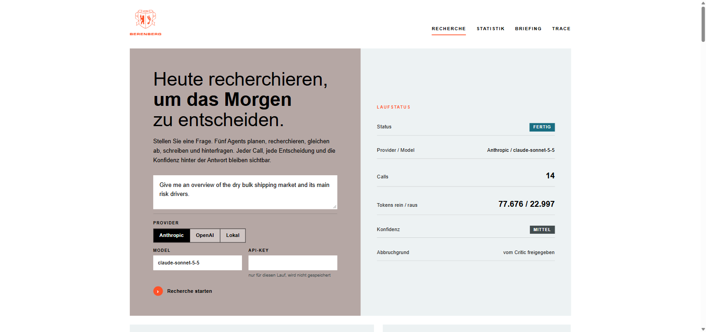
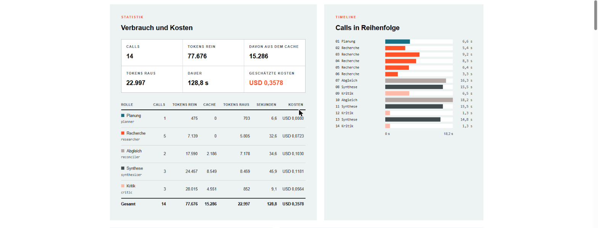
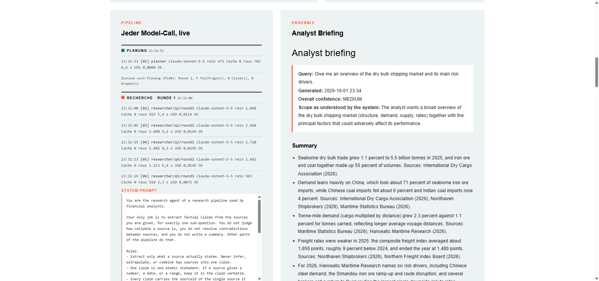
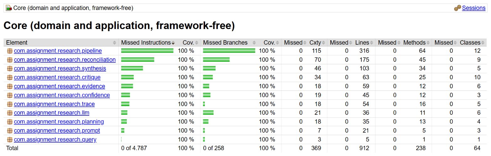
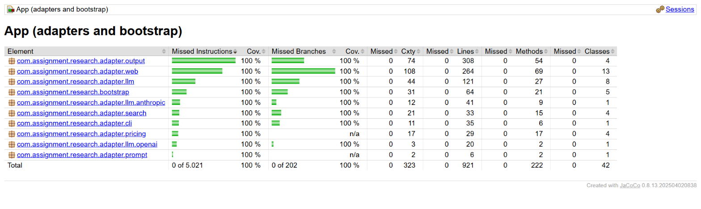

# Analyst Research Pipeline
[](https://openjdk.org/projects/jdk/25/)
[](https://maven.apache.org)
[](#architecture)
[](#run-it)
[](https://github.com/YasinY/analyst-research-pipeline/actions/workflows/ci.yml)

Turns a free-text analyst question into a structured briefing with a confidence level that is computed from the run record, not asserted by a model. Five LLM agents (planner, researcher, reconciler, synthesizer, critic) work against a fictional mock corpus of 15 dry bulk shipping sources. Plain Java: JDK `HttpClient` and `HttpServer`, Jackson, Lombok, no framework.

---

 
 

---
## Run it

Requirements: JDK 25 and an API key for Anthropic or for an OpenAI-compatible endpoint (or a local model served by Ollama).

The intended way is the web UI:

1. Download `research-pipeline.zip` from the [latest release](../../releases/latest) and unzip it. It contains the jar and the `data/` folder (prompts, mock corpus, pricing) the jar reads at startup. Or build it yourself with `./mvnw -B package` and run from the repository root.
2. Start the server and open [http://127.0.0.1:8787](http://127.0.0.1:8787):

   ```bash
   java -jar research-pipeline.jar --serve
   ```

3. Enter the analyst query, pick the provider (Anthropic, OpenAI or local), the model and your API key, and start the run. The key is used for that run only and is never stored or returned. The page follows the run live: every model call grouped by phase with start time, duration, tokens in, tokens served from the provider's prompt cache, tokens out and estimated cost (from `data/pricing.json`), a per-role table, a timeline, each call expandable to its prompt and raw response, and finally the briefing. The run id is kept in the URL (`?run=run-1`), so the page survives a reload.

The CLI does the same without a browser and reads the key from the environment:

```bash
java -jar research-pipeline.jar --query "Give me an overview of the dry bulk shipping market and its main risk drivers."
./mvnw -B test        # tests only; JaCoCo enforces 100% line and branch coverage, report under core|app/target/site/jacoco
```

JaCoCo report of the current build, both modules at 100 percent line and branch coverage:

 

- `LLM_PROVIDER`: `anthropic` (default), `openai` or `local`
- `ANTHROPIC_API_KEY`, `ANTHROPIC_MODEL` (default `claude-sonnet-5-5`), `ANTHROPIC_API_URL`
- `OPENAI_API_KEY`, `OPENAI_MODEL` (default `gpt-5.4-mini`), `OPENAI_API_URL` (default OpenAI chat completions)
- `LOCAL_API_URL` (default Ollama, `http://localhost:11434/v1/chat/completions`), `LOCAL_MODEL` (default `llama3.1`); the local provider uses the OpenAI-compatible client without a key
- `DATA_DIR` (default `./data`), `RUNS_DIR` (default `./runs`), `PORT` (default `8787`)

Every run writes a folder under `runs/` with `briefing.md`, `result.json`, `state.json`, `trace.json`, every prompt and raw response under `calls/`, and a state snapshot after each step under `state/`.

## Example output

The same query, run once per provider after the final changes (prompt caching on, cost from `data/pricing.json`):

- [`examples/dry-bulk-shipping-claude-sonnet-5-5`](examples/dry-bulk-shipping-claude-sonnet-5-5/briefing.md): 1 research round, 13 model calls, 71,092 tokens in of which 15,684 served from the prompt cache, estimated USD 0.33, confidence MEDIUM, approved by the critic after two revisions
- [`examples/dry-bulk-shipping-gpt-5.4-mini`](examples/dry-bulk-shipping-gpt-5.4-mini/briefing.md): 1 research round, 13 model calls, 32,369 tokens in of which 5,632 cached, estimated USD 0.05, confidence LOW with 1 open major review finding (`REWRITE_LIMIT_REACHED`)

The briefing lists open review findings instead of hiding them, and a single open major finding caps confidence at LOW by design. Outcomes vary between runs of the same query: with Sonnet, five of seven runs after the last prompt change ended MEDIUM and approved, the others LOW with the open findings printed.

## Architecture

Hexagonal, two modules. `core` holds the domain, the agents and the orchestration and depends only on ports (`LLMPort`, `SourceSearchPort`, `PromptTemplates`). `app` holds the adapters: Anthropic and OpenAI-compatible clients with retry, JSON corpus search, file-based prompts, CLI, web UI and the run archive.

- **Planner** splits the query into sub-questions with search keywords.
- **Researcher** searches the corpus per sub-question and extracts claims with source references.
- **Reconciler** groups claims that assert the same fact and lists conflicts between groups. It does not judge reliability.
- **Synthesizer** writes summary, key facts and uncertainties. Every statement cites evidence group ids; unknown ids are dropped.
- **Critic** reviews the draft against the evidence and returns typed findings, each either a rewrite (unsupported, overstated, smoothed conflict, ...) or a research request (missing evidence, with keywords). On a revised draft it sees its previous findings, so it reports what is still open instead of raising the bar.

Why this shape:

- Each agent has one narrow job and a JSON contract, so a bad output is attributable to one step and one prompt in `data/prompts/`.
- Control flow is deterministic Java (`TransitionPolicy`), not a model deciding what to do next. The loop is testable without an LLM and cannot run away.
- Everything numeric (source tiers, independence, recency, confidence) is code. Models only read, group and write.
- A failed researcher or reconciler call is recorded and the run continues with what it has; only a failed plan or first draft aborts.

## State

- One immutable `BriefingState` value holds the whole run: query, sub-questions, pending and exhausted ids, sources, claims, evidence groups with confidences, draft, critiques, round and rewrite counters, failures and the stop decision.
- `BriefingOrchestrator` loops: `TransitionPolicy.next(state)` picks the step, the step returns a new state via `toBuilder()`, the observer gets the result. Agents never see the state object, only the input they need.
- `TracingLLMPort` records every call (prompt, response, tokens, duration) separately from the state; the archive writes both to disk, so every decision in a run can be traced back to its prompt and response.

## Enough and confidence

The run stops at the first of:

- the critic returns no findings (`APPROVED`)
- research is requested but every open sub-question was already searched without new evidence (`NO_NEW_EVIDENCE`)
- 2 research rounds are used while sub-questions still lack adequate evidence (`ROUND_LIMIT_REACHED`)
- two rewrites per round are used and findings remain (`REWRITE_LIMIT_REACHED`)
- 30 model calls are used (`CALL_BUDGET_EXHAUSTED`), or the critic or a revision fails (`AGENT_FAILURE`)

A sub-question is covered when at least one evidence group for it scores MEDIUM or better. Before the first draft, uncovered and not yet exhausted sub-questions get another research round; after a critique, research findings become follow-up sub-questions.

Per evidence group (`ConfidenceCalculator`), each factor is listed in the briefing:

- base from the best independent source tier: A (official statistics, industry bodies) 0.60, B (reports, brokers, press) 0.40, C (blogs, forums) 0.15
- +0.15 per additional independent source, capped at +0.30; a source citing another source in the same group does not count
- -0.20 if the newest source is 3 or more years old
- conflict: open -0.30, won by recency -0.10, superseded by a source 3+ years newer -0.50
- HIGH from 0.70, MEDIUM from 0.40, else LOW

For the briefing (`BriefingConfidenceAggregator`): the median of the best group score behind each key fact gives the level, capped at MEDIUM if any sub-question is uncovered and at LOW if a major review finding is open or the review failed. The reasons are printed under "Confidence" in the briefing.

## With more time

- Few-shot examples per agent role, loaded next to the prompts in `data/prompts/`; the reconciler's remaining mistakes (merging different numbers, reporting non-conflicts) are the kind a worked example fixes better than another rule.
- An evaluation set of queries with planted conflicts, derivative sources and gaps, asserting structural properties of the run in CI against recorded responses.
- Calibrate the confidence weights against analyst judgement instead of hand-set constants.
- Model routing per role: the reconciler and critic benefit from a stronger model, the researcher does not; the port already allows one adapter per agent.
- Prompt caching: order prompts stable-first so the evidence block is a cacheable prefix, mark it for Anthropic, report cached tokens and cost per call.
- Real retrieval behind `SourceSearchPort` instead of keyword search over a mock corpus, and research calls per sub-question in parallel.

## Time spent

Honest record of the time spent on this submission.

| Block | Start | Stop | Gross | Net development | Notes |
|-------|-------|------|-------|-----------------|-------|
| 1 | 2026-10-01 18:37 | 2026-10-01 19:50 | 73 min | 66 min | Skeleton, ports, five agents, confidence model, pipeline orchestration, tests. Paused at 19:50 for an appointment at 20:00. |
| 2 | 2026-10-01 20:29 | 2026-10-01 21:18 | 49 min | 25 min | App module, LLM adapters for OpenAI-compatible and Anthropic endpoints, mock corpus, CLI, first real runs and prompt tuning. Includes a dinner break. |
| 3 | 2026-10-01 21:31 | 2026-10-01 22:30 | 59 min | ca. 40 min | Beyond the required scope: global reconciliation, web UI, code review with fixes, coverage to 100 percent, CI, README. Agents working in parallel count as development time. |
| 4 | 2026-10-01 22:33 | 2026-10-01 23:05 | 32 min | ca. 25 min | Statistics: cached tokens, Anthropic prompt caching, pricing and cost estimate, German web UI with timeline, role table and per-run provider selection, local provider via Ollama. |
| 5 | 2026-10-01 23:05 | 2026-10-01 23:28 | 23 min | ca. 15 min | Critic sees its previous findings, two rewrites per round, pipeline view grouped by phase with start times, one evidence note per key fact, analyst-facing briefing wording. |
| **Total** | | | **236 min (3 h 56)** | **ca. 171 min (2 h 51)** | Blocks 1 and 2 cover everything the task asked for in 91 minutes net. |

Gross is wall-clock time. Net development excludes build times, pipeline runs, and reading their output.

The detailed log lives in [`docs/timelog.md`](docs/timelog.md).
